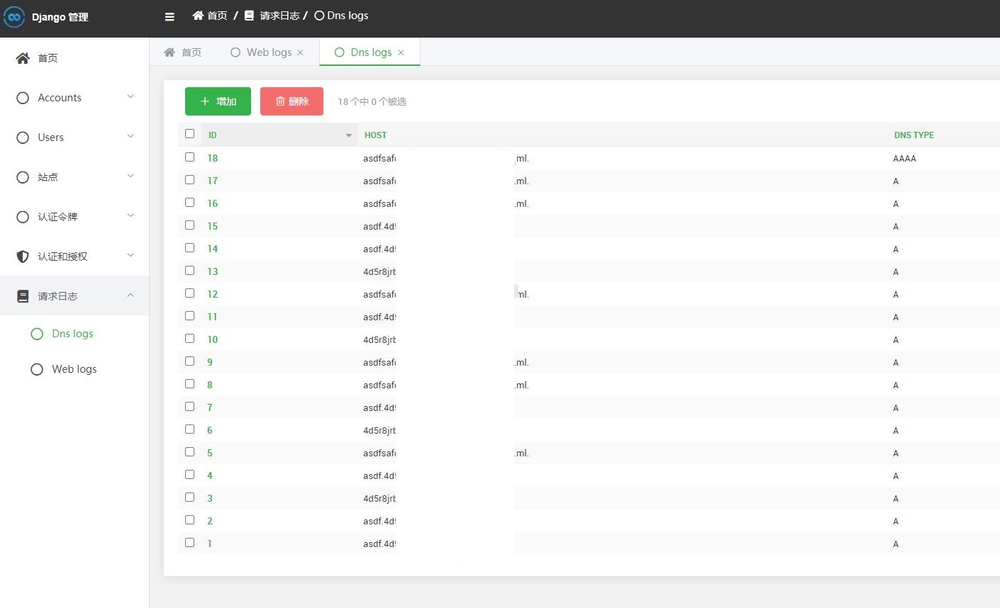
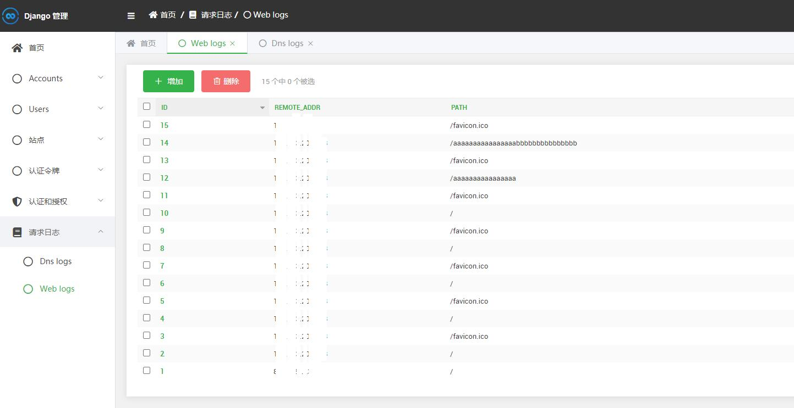
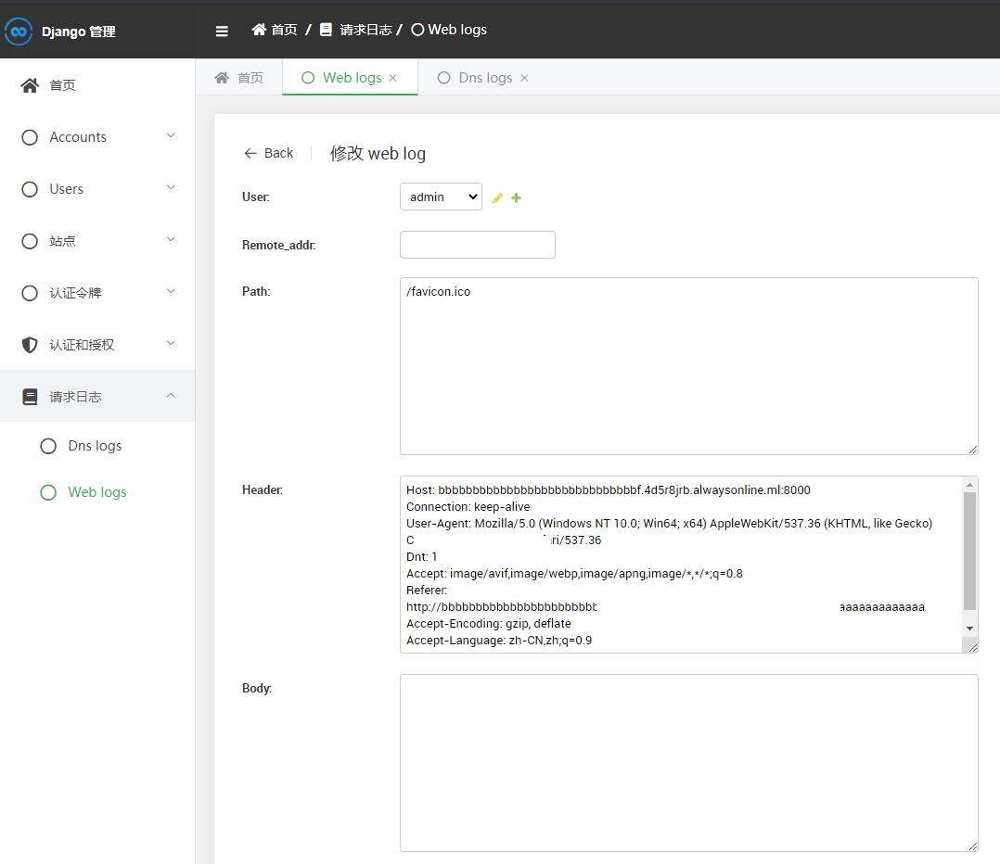

简介
---

本版本是把dnslog重构了一遍，几乎没有之前的东西了。暂时使用Django Admin作为管理数据的
UI，后续可能会使用AntDesign重构UI部分

安装
---

## 解析服务配置

A.com,B.com两个域名，IP为x.x.x.x的服务器

A域名配置NX解析

ns1.A.com x.x.x.x
ns2.A.com x.x.x.x

B域名设置NameServer到ns1.A.com,ns2.A.com

本地测试或开发需要配置Hosts

```
# dnslog.dev

127.0.0.1 admin.dnslog.test
127.0.0.1 api.dnslog.test
127.0.0.1 ns1.dnslog.test
127.0.0.1 ns2.dnslog.test

```

## Docker部署

暂未完成（WIP）

## 普通安装

普通安装只需要把`.env.example`文件重命名为`.env`

使用以下两条命令分别启动DnsServer和WebServer

```Bash
## 正式环境
gunicorn -c gunicorn.py config.wsgi -b :8000
DJANGO_SETTINGS_MODULE=config.settings.production python manage.py dnsserver

## 开发环境
DJANGO_READ_DOT_ENV_FILE=true python manager.py runserver_plus
python manage.py dnsserver
```

可以通过以下的命令进行测试

```
export prefix="用户的域名前缀"
for i in {1..100}
do
    rand=`cat /proc/sys/kernel/random/uuid | sed "s/-/./g"`
    echo $rand
    dig @ns1.dnslog.test $rand.$prefix.dnslog.test > /dev/null for i in {1..100}
done
```

## 问题解决

### 数据库连接过多

在进行大量的测试的时候有时候会数据库连接数量超限，可以连接到数据库上通过以下命令查看最大连接数

```
show variables like '%max_connections%';
```

然后可以通过以下命令进行调整

```
set GLOBAL max_connections=1024;
```

这里的连接优化只是简单的提了一下从数据库的层面进行优化，其实还应该有数据的优化，暂且不表，
有相关的建议可以提交Issues。


使用效果
---

Dnslog



Server


WebLog



View weblog


